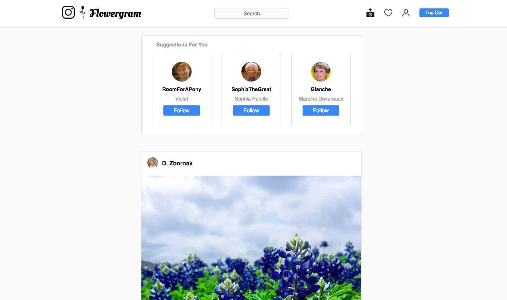
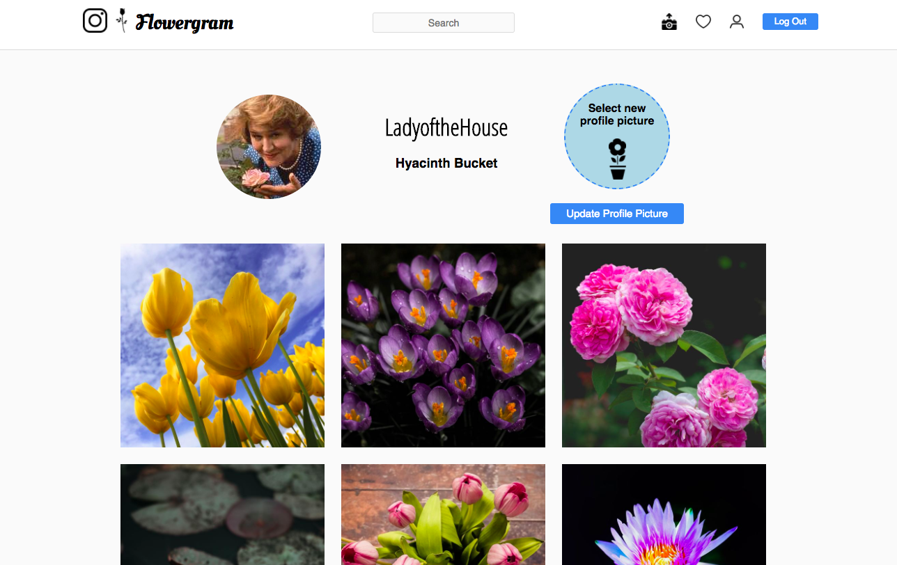
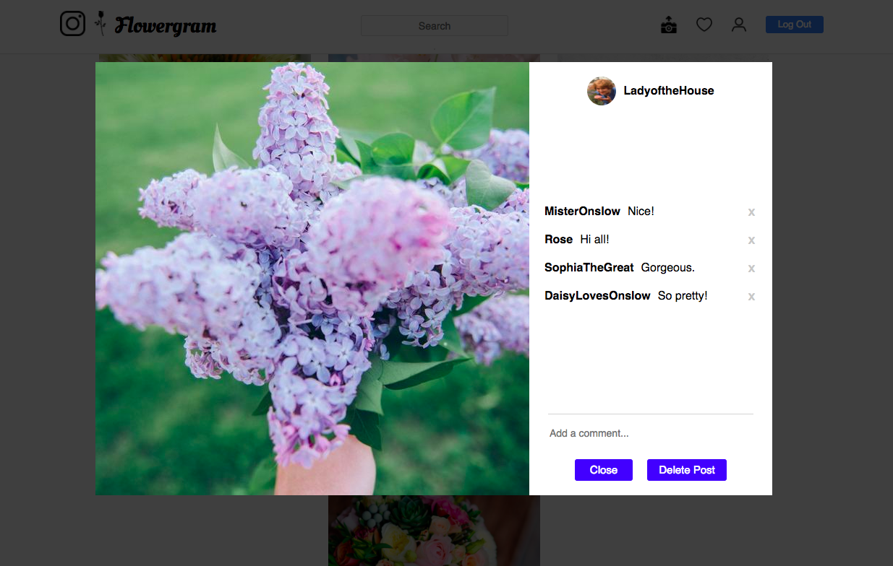
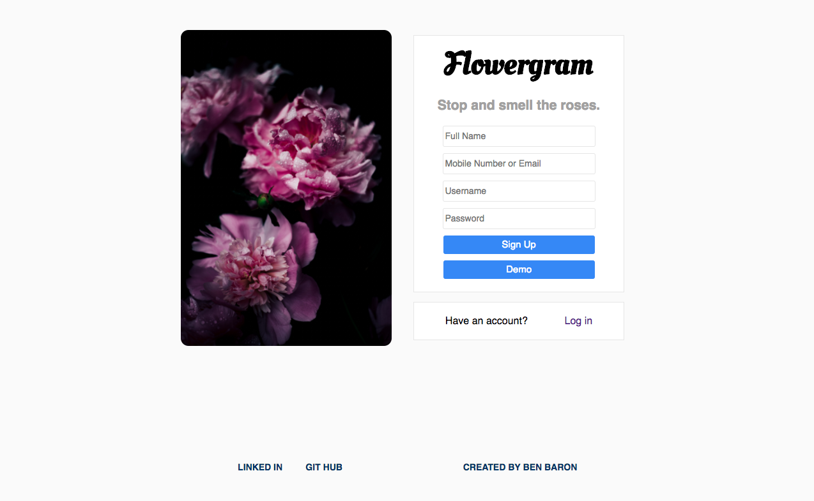
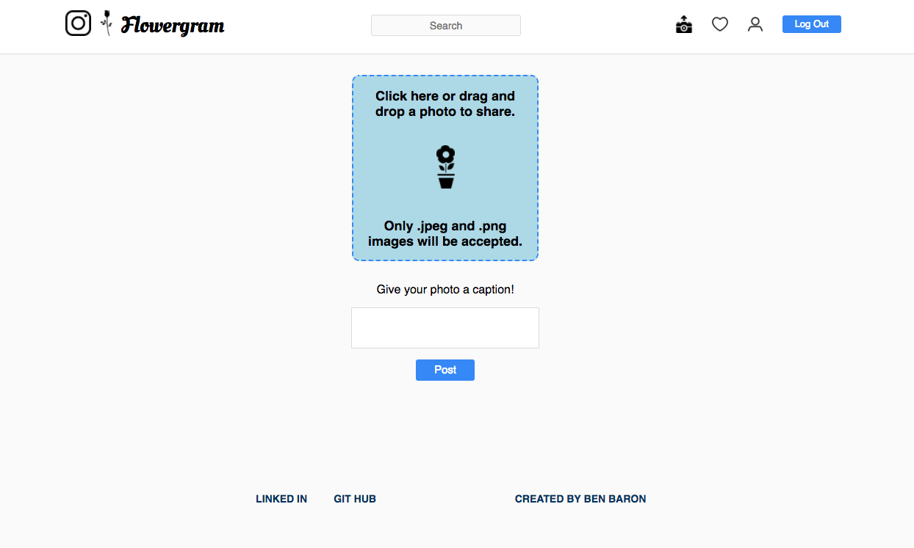

# Flowergram

[Flowergram live][heroku]

[heroku]: https://flowergram.herokuapp.com/

Flowergram is a full stack web application inspired by Instagram and built using Ruby on Rails for the backend, a PostgreSQL database, and React.js with a Redux architectural framework for the frontend. Additional tools leveraged include jQuery, JBuilder, BCrpyt, Paperclip, React Modal and Amazon Web Services.

## Features & Implementation

### Homepage Rendering

  Posts are stored in the database's posts table with columns for `image`, `caption`, and `author_id`. A comments table stores columns for the comment's `body`, `post_id`, and `author_id`. Comments can only be deleted by the comment's author or the post's author which was commented on.

  A likes table has columns for `post_id` and `liker_id`. When a user likes and unlikes a post, rows are created and destroyed in this table.

  The homepage displays posts created by users the logged in user is following and the logged in user's own posts.

  

### Followers & Search

  A follows table in the database connects each user with the users they have elected to follow through `follower_id` and `followee_id` columns. Users can follow or unfollow users, which in turn updates the posts shown to the follower.

  The header provides a search bar for users to search for new people to follow as well as their current connections. Users the current user follows appear higher in search results than strangers.

### Profile Rendering

  The profile page includes the information from the users database table, from the columns `username`, `full_name`, `profile_pic`. A follow/unfollow button appears for all user profiles except the logged in user. All pictures from posts the user created appear chronologically.

  The profile page of the logged in user also includes the ability to load, preview, and then finalize a profile picture change.

  Modals of posts are available by clicking on images in a profile page. Modals allow a user to comment and delete posts.

### User Authentication

  The sign up and login page verifies unique credentials and hashes passwords using BCrypt. Helpful error messages are displayed should a user enter invalid information.

  Upon creating a new account, a user can begin following other users to populate the homepage with images. The user can also update their profile picture from the default rose icon.

### Post Creation

The upload page allows users to drag and drop or click and upload photos to post. A preview of the image appears once loaded and upon creating the post, the user is redirected back to the homepage where the post appears.

## Flowergram's Coming Attractions:

I anticipate adding the following features to the project:

### Direct Messaging

Users will be able to send private direct messages to other users. A user will be able to message users they do not follow.

### Hashtags

Users will be able to click on a post's hashtags to view other posts with the same hashtag as well as search by hashtag.
